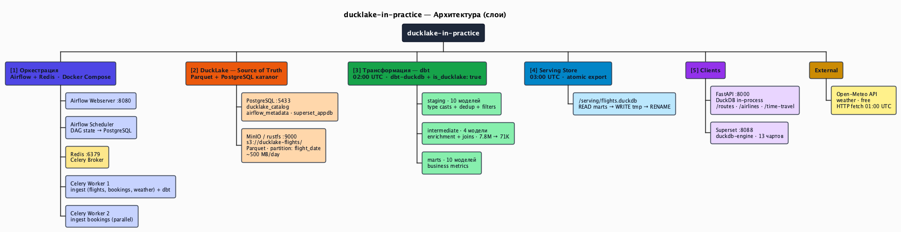
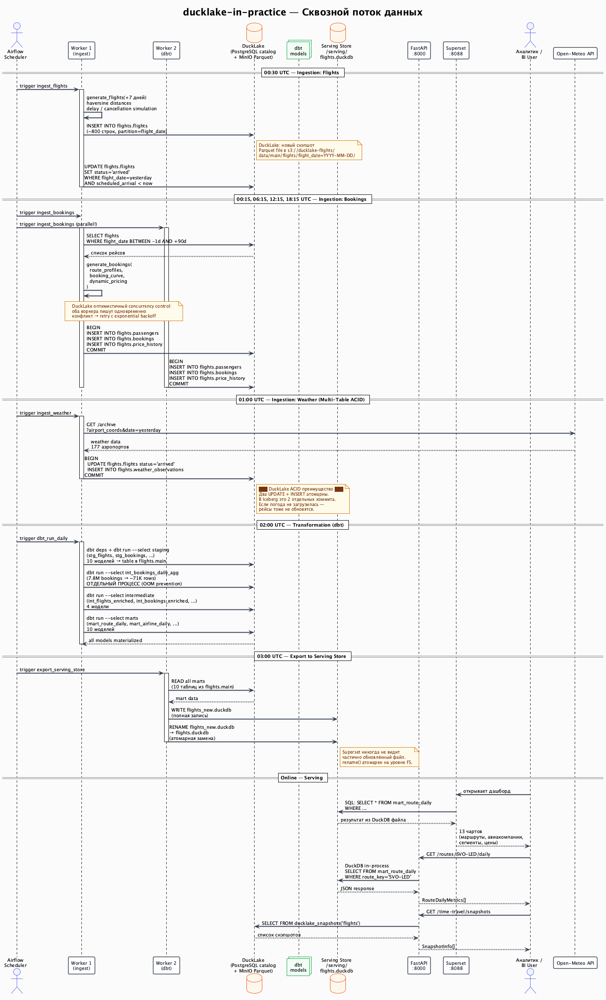

# ducklake-in-practice

**Production-grade lakehouse sandbox on DuckDB + DuckLake**

An analytics platform for Russian domestic flight bookings, demonstrating the capabilities and limitations of the DuckDB ecosystem for building a full-featured lakehouse.

## Project Goal

Answer the question: **what does a mature lakehouse built on the DuckDB ecosystem look like?**

The project intentionally applies production patterns to a small data volume (~500 MB/day). Architectural decisions are made as if the data were orders of magnitude larger. All limitations and workarounds are documented honestly.

## What's Inside

- **~99,200 flights**, **~7.8M bookings**, **~213,600 price history records** and **~17,000 weather observations** on synthetic Russian domestic flight data
- Full lakehouse stack: ingestion → staging → intermediate → marts → serving
- Discovered and documented DuckLake first-run gotchas

## Stack

| Component | Technology | Role |
|-----------|-----------|------|
| Object storage | MinIO (rustfs alias) | S3-compatible Parquet file storage |
| Metadata catalog | PostgreSQL | DuckLake catalog + Airflow metadata + Superset appdb |
| Lakehouse format | DuckLake | ACID, time travel, schema evolution, partitioning |
| Compute engine | DuckDB | Write, transform, read — in-process |
| Orchestration | Airflow (CeleryExecutor) | DAGs for ingestion, transformations, and export |
| Message broker | Redis | Celery broker |
| Transformations | dbt (dbt-duckdb) | staging → intermediate → marts |
| BI | Apache Superset | Dashboards on top of the serving store |
| API | FastAPI | REST analytics, DuckDB in-process |

## Architecture



> PlantUML source: [`docs/diagrams/01_architecture.puml`](../diagrams/01_architecture.puml)

## Data Flow



> PlantUML source: [`docs/diagrams/05_data_flow.puml`](../diagrams/05_data_flow.puml)

## Key Design Decisions

1. **DuckLake is the single source of truth.** All data lives in DuckLake. The serving store is a derived, scheduled export.
2. **dbt pre-aggregates.** Heavy compute runs in dbt on a schedule. Serving only reads ready-made marts.
3. **Serving store is the right pattern, not a workaround.** Exporting mart tables from DuckLake to `flights.duckdb` is the standard export-to-serving pattern (analogous to Iceberg→Redshift, Delta→Synapse). Superset and FastAPI read a lightweight file without needing DuckLake extensions.
4. **One PostgreSQL — three databases:** `ducklake_catalog`, `airflow_metadata`, `superset_appdb`.
5. **Data: OpenFlights seed + synthetic generation.** No external APIs. ~500 MB Parquet/day.
6. **Russian domestic flights only.** Scaling via seed expansion.

## Quick Start

```bash
# 1. Clone and configure
git clone <repo-url> && cd ducklake-in-practice
cp .env.example .env

# 2. Start services and load seeds
docker compose up -d
make seeds                                        # airports, airlines, routes, aircraft types

# 3. Generate historical data
make backfill FROM=2026-01-01 TO=2026-04-08      # flights, bookings, weather

# 4. Run dbt (layers run separately to avoid OOM)
make dbt-run

# 5. Export to serving store
docker compose exec airflow-worker-1 \
    python /opt/ducklake-in-practice/docker/export-serving-store.py
```

> Full step-by-step guide with troubleshooting: **[QUICKSTART.md](QUICKSTART.md)**

## Service URLs

| Service | URL | Credentials |
|---------|-----|-------------|
| Airflow | http://localhost:8080 | admin / admin |
| FastAPI docs | http://localhost:8000/docs | — |
| Superset | http://localhost:8088 | admin / admin |
| MinIO console | http://localhost:9001 | rustfsadmin / rustfsadmin123 |
| PostgreSQL | localhost:5433 | ducklake / (see .env) |

## Documentation

| Document | Description |
|----------|-------------|
| [QUICKSTART.md](QUICKSTART.md) | Step-by-step setup guide: from clone to dashboards |
| [ARCHITECTURE.md](ARCHITECTURE.md) | Full architecture, services, decisions, first-run lessons |
| [DATA_MODEL.md](DATA_MODEL.md) | Data model, tables, columns, generation patterns |
| [DBT_LAYERS.md](DBT_LAYERS.md) | dbt layers, all models, materializations, critical fixes |
| [DUCKLAKE_FEATURES.md](DUCKLAKE_FEATURES.md) | DuckLake features with concrete examples, limitations, gotchas |
| [SCALING.md](SCALING.md) | Current limits, growth paths, decision matrix |

### Diagrams

| Diagram | Description |
|---------|-------------|
| [01 — Architecture](../diagrams/01_architecture.puml) | Services, network, component interactions |
| [02 — Data Model](../diagrams/02_data_model.puml) | DuckLake tables, fields, relations, partitioning |
| [03 — dbt Lineage](../diagrams/03_dbt_lineage.puml) | Full dependency graph of all dbt models |
| [04 — Airflow DAGs](../diagrams/04_airflow_dags.puml) | 6 DAGs, schedules and tasks |
| [05 — Data Flow](../diagrams/05_data_flow.puml) | End-to-end sequence: generation → DuckLake → serving → BI |
| [06 — FastAPI](../diagrams/06_api.puml) | All endpoints, parameters, data sources |
| [07 — DuckLake Internals](../diagrams/07_ducklake_internals.puml) | Snapshots, partitions, ACID, time travel |

Russian version: [../ru/README.md](../ru/README.md)

## License

MIT
