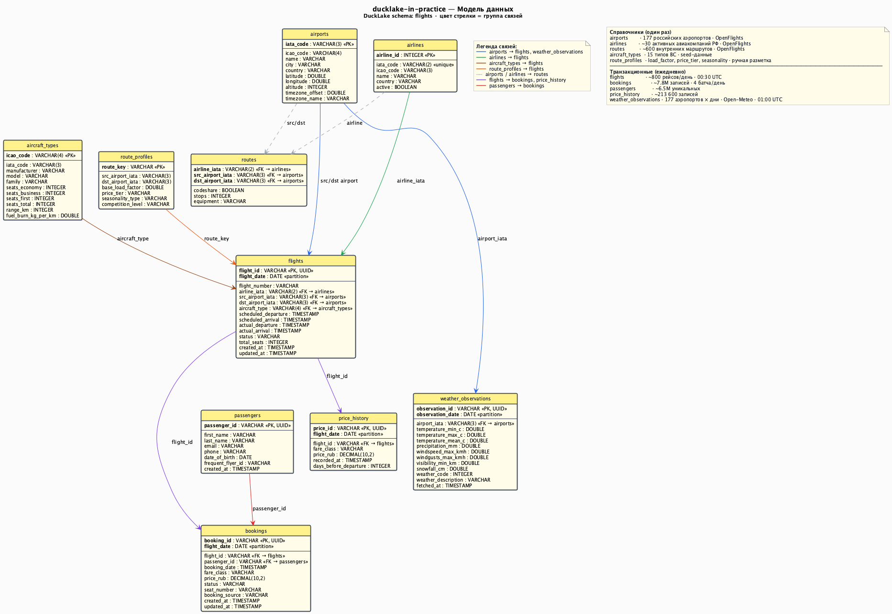

# Модель данных ducklake-in-practice



> PlantUML-источник: [`docs/diagrams/02_data_model.puml`](../diagrams/02_data_model.puml)

## Обзор

Данные делятся на две категории:

- **Справочные (seed)** — загружаются из OpenFlights один раз, обновляются редко
- **Транзакционные (generated)** — генерируются Python-генератором по расписанию (~500 МБ Parquet/день)

Область: внутренние рейсы РФ. Масштабирование: МСК → РФ → СНГ через расширение seed-данных.

## Схема связей

```
airports ──┬──────────────────────────────────────────────────────┐
           │                                                      │
airlines ──┼── routes                  aircraft_types            │
           │     │                         │                     │
           │     ▼                         │                     │
           └── flights ──┬── bookings ──── passengers            │
                    │    │                                        │
                    │    └── price_history                        │
                    │                                             │
airports ───────────────────────────────────────────────────────--┘
(src + dst)         │
                    ▼
           weather_observations
           (airport × date)
```

## Seed-данные (OpenFlights)

### airports

Источник: `https://raw.githubusercontent.com/jpatokal/openflights/master/data/airports.dat`

| Поле | Тип | Описание |
|------|-----|----------|
| airport_id | INTEGER | PK, OpenFlights ID |
| name | VARCHAR | Название аэропорта |
| city | VARCHAR | Город |
| country | VARCHAR | Страна |
| iata_code | VARCHAR(3) | IATA-код (SVO, DME, LED...) |
| icao_code | VARCHAR(4) | ICAO-код |
| latitude | DOUBLE | Широта |
| longitude | DOUBLE | Долгота |
| altitude | INTEGER | Высота (футы) |
| timezone_offset | DOUBLE | Смещение UTC |
| timezone_name | VARCHAR | Часовой пояс (Europe/Moscow) |

Фильтр при загрузке: `country = 'Russia'`.

Основные аэропорты: SVO (Шереметьево), DME (Домодедово), VKO (Внуково), ZIA (Жуковский), LED (Пулково), KZN (Казань), SVX (Кольцово), OVB (Толмачёво), KRR (Краснодар), AER (Сочи), ROV (Платов), UFA (Уфа), GOJ (Стригино), KUF (Курумоч), CEK (Челябинск).

### airlines

Источник: `https://raw.githubusercontent.com/jpatokal/openflights/master/data/airlines.dat`

| Поле | Тип | Описание |
|------|-----|----------|
| airline_id | INTEGER | PK |
| name | VARCHAR | Название |
| iata_code | VARCHAR(2) | IATA-код (SU, S7, DP, UT, U6...) |
| icao_code | VARCHAR(3) | ICAO-код |
| country | VARCHAR | Страна |
| active | BOOLEAN | Действующая |

Фильтр: `country = 'Russia' AND active = true`.

### routes

Источник: `https://raw.githubusercontent.com/jpatokal/openflights/master/data/routes.dat`

| Поле | Тип | Описание |
|------|-----|----------|
| airline_iata | VARCHAR(2) | FK → airlines |
| src_airport_iata | VARCHAR(3) | FK → airports |
| dst_airport_iata | VARCHAR(3) | FK → airports |
| codeshare | BOOLEAN | Codeshare рейс |
| stops | INTEGER | Пересадки (0 = прямой) |
| equipment | VARCHAR | Типы ВС (320, 73H...) |

Фильтр: оба аэропорта — российские.

## Транзакционные данные (generated)

### flights

Генерируется ежедневно. Расписание на 7 дней вперёд.

| Поле | Тип | Описание |
|------|-----|----------|
| flight_id | VARCHAR | PK, UUID |
| flight_number | VARCHAR | SU-1234 |
| airline_iata | VARCHAR(2) | FK → airlines |
| src_airport_iata | VARCHAR(3) | FK → airports |
| dst_airport_iata | VARCHAR(3) | FK → airports |
| scheduled_departure | TIMESTAMP | Плановый вылет |
| scheduled_arrival | TIMESTAMP | Плановый прилёт |
| actual_departure | TIMESTAMP | Фактический вылет (NULL до вылета) |
| actual_arrival | TIMESTAMP | Фактический прилёт |
| status | VARCHAR | scheduled/boarding/departed/arrived/cancelled/delayed |
| aircraft_type | VARCHAR | A320, B738, SU95... |
| total_seats | INTEGER | Общее количество мест |
| flight_date | DATE | Дата рейса (ключ партиции) |
| created_at | TIMESTAMP | Время создания записи |
| updated_at | TIMESTAMP | Время обновления |

Партиционирование: по `flight_date`.

### bookings

Генерируется 4 раза в сутки (00:15, 06:15, 12:15, 18:15 UTC). Каждый батч охватывает рейсы от вчера до +90 дней.

| Поле | Тип | Описание |
|------|-----|----------|
| booking_id | VARCHAR | PK, UUID |
| flight_id | VARCHAR | FK → flights |
| passenger_id | VARCHAR | FK → passengers |
| booking_date | TIMESTAMP | Дата бронирования |
| fare_class | VARCHAR | economy/business/first |
| price_rub | DECIMAL(10,2) | Цена в рублях |
| status | VARCHAR | confirmed/cancelled/checked_in/boarded/no_show |
| seat_number | VARCHAR | 12A, 28F... (NULL до регистрации) |
| booking_source | VARCHAR | web/mobile/agency/corporate |
| created_at | TIMESTAMP | Время создания |
| updated_at | TIMESTAMP | Время обновления |

### passengers

| Поле | Тип | Описание |
|------|-----|----------|
| passenger_id | VARCHAR | PK, UUID |
| first_name | VARCHAR | Имя |
| last_name | VARCHAR | Фамилия |
| email | VARCHAR | Email (может содержать ошибки) |
| phone | VARCHAR | Телефон |
| date_of_birth | DATE | Дата рождения |
| frequent_flyer_id | VARCHAR | Номер программы лояльности (NULL у ~70%) |
| created_at | TIMESTAMP | Время создания |

### price_history

Генерируется вместе с bookings. Отслеживает изменения цен на маршрут.

| Поле | Тип | Описание |
|------|-----|----------|
| price_id | VARCHAR | PK, UUID |
| flight_id | VARCHAR | FK → flights |
| fare_class | VARCHAR | economy/business/first |
| price_rub | DECIMAL(10,2) | Цена |
| recorded_at | TIMESTAMP | Момент записи |
| days_before_departure | INTEGER | Дней до вылета |

## Стратегия партиционирования

| Таблица | Ключ партиции | Логика |
|---------|--------------|--------|
| flights | flight_date | По дате рейса |
| bookings | flight_date | По дате рейса (через FK к flights) |
| price_history | flight_date | По дате рейса |
| passengers | — | Нет партиционирования (справочник) |
| airports | — | Seed-данные, не партиционируются |
| airlines | — | Seed-данные, не партиционируются |
| routes | — | Seed-данные, не партиционируются |

Структура файлов в MinIO:
```
s3://ducklake-flights/data/main/
  flights/
    flight_date=2025-01-01/
      data_xxxxx.parquet
    flight_date=2025-01-02/
      data_yyyyy.parquet
  bookings/
    flight_date=2025-01-01/
      ...
  price_history/
    flight_date=2025-01-01/
      ...
```

## Бизнес-логика генератора

### Сезонность
- Лето (июнь–август): ×1.4 к базовой цене, ×1.3 к количеству бронирований
- Новый год (25 дек – 10 янв): ×1.6 цена, ×1.5 бронирований
- Южные направления (AER, KRR) зимой: ×1.3 дополнительно

### Dynamic pricing
- 60+ дней до вылета: ×0.7 от базовой цены
- 30–60 дней: ×0.85
- 14–30 дней: ×1.0
- 7–14 дней: ×1.2
- 1–7 дней: ×1.5
- День вылета: ×2.0

### Задержки и отмены
- ~15% рейсов задерживаются (нормальное распределение, μ=30 мин, σ=45 мин)
- ~2.5% рейсов отменяются
- Зимой задержки ×1.5 (погода)

## Намеренные неидеальности данных

Данные содержат намеренные дефекты качества для демонстрации dbt-тестов и обработки в staging-слое.

| Дефект | Частота | Таблица | Обработка в staging |
|--------|---------|---------|-------------------|
| Дубликаты бронирований | ~1% | bookings | UUID-ключи из генератора гарантируют уникальность; фильтр WHERE price_rub > 0 |
| Пустой email | ~3% | passengers | Фильтрация или замена на NULL |
| Отрицательная цена | ~0.5% | bookings, price_history | WHERE price_rub > 0 |
| Задержка обновления статуса | ~2% рейсов | flights | Остаётся scheduled после вылета |
| Неполное обновление actual_departure | ~2% | flights | actual_departure может появиться через 1–2 батча |

## Объёмы данных

| Таблица | Записей/день | Размер Parquet/день |
|---------|-------------|-------------------|
| flights | ~800 | ~2 МБ |
| bookings | ~4 000 | ~15 МБ |
| passengers | ~3 500 | ~10 МБ |
| price_history | ~12 000 | ~30 МБ |

Итого (~500 МБ/день достигается через более частые записи price_history и вспомогательные события).

Текущий объём данных в проекте: ~99 200 рейсов, ~7.8M бронирований, ~213 600 записей price_history, ~17 000 погодных наблюдений.

## Seed-данные: типы воздушных судов (aircraft_types)

Источник: `data/seeds/aircraft_types.csv` — публичные технические характеристики.

| Поле | Тип | Описание |
|------|-----|----------|
| icao_code | VARCHAR(4) | PK (A320, B738, SU95...) |
| iata_code | VARCHAR(3) | IATA-код |
| manufacturer | VARCHAR | Производитель (Airbus, Boeing, Sukhoi...) |
| model | VARCHAR | Модель (A320-200, 737-800...) |
| family | VARCHAR | Семейство (A320, B737NG, SSJ100...) |
| seats_economy | INTEGER | Кресла эконом |
| seats_business | INTEGER | Кресла бизнес |
| seats_first | INTEGER | Кресла первый класс |
| seats_total | INTEGER | Всего кресел |
| range_km | INTEGER | Максимальная дальность, км |
| fuel_burn_kg_per_km | DOUBLE | Расход топлива, кг/км |
| first_flight_year | INTEGER | Год первого полёта типа |
| engine_type | VARCHAR | turbofan / turboprop |
| body_type | VARCHAR | narrowbody / widebody |

17 типов ВС: A319/320/321, A330-200/300, B737-700/800, B767, B777, SSJ100, E170/190, ATR72, CRJ200, A320neo, A321neo.

## Транзакционные данные: погодные наблюдения (weather_observations)

Источник: Open-Meteo Archive API (бесплатно, без ключа). Загружается ежедневно DAG `ingest_weather`.

| Поле | Тип | Описание |
|------|-----|----------|
| observation_id | VARCHAR | PK, UUID |
| airport_iata | VARCHAR(3) | FK → airports |
| observation_date | DATE | Дата (ключ партиции) |
| temperature_min_c | DOUBLE | Минимальная температура, °C |
| temperature_max_c | DOUBLE | Максимальная температура, °C |
| temperature_mean_c | DOUBLE | Средняя температура, °C |
| precipitation_mm | DOUBLE | Осадки, мм |
| windspeed_max_kmh | DOUBLE | Максимальная скорость ветра, км/ч |
| windgusts_max_kmh | DOUBLE | Порывы ветра, км/ч |
| visibility_min_km | DOUBLE | Минимальная видимость, км |
| snowfall_cm | DOUBLE | Снегопад, см |
| weather_code | INTEGER | WMO код погоды |
| weather_description | VARCHAR | Описание на русском |
| fetched_at | TIMESTAMP | Время загрузки |

**Партиционирование:** по `observation_date`.

**WMO коды:** 0 = ясно, 45/48 = туман, 61–65 = дождь, 71–77 = снег, 95–99 = гроза.

## Стратегия партиционирования

| Таблица | Ключ партиции | Логика |
|---------|--------------|--------|
| flights | flight_date | По дате рейса |
| bookings | flight_date | По дате рейса (через FK к flights) |
| price_history | flight_date | По дате рейса |
| weather_observations | observation_date | По дате наблюдения |
| passengers | — | Нет партиционирования (справочник) |
| airports | — | Seed-данные, не партиционируются |
| airlines | — | Seed-данные, не партиционируются |
| routes | — | Seed-данные, не партиционируются |
| aircraft_types | — | Seed-данные, не партиционируются |

Структура файлов в MinIO:
```
s3://ducklake-flights/data/main/
  flights/flight_date=2025-01-01/data_xxxxx.parquet
  bookings/flight_date=2025-01-01/...
  price_history/flight_date=2025-01-01/...
  weather_observations/observation_date=2025-01-01/...
```

## Бизнес-логика генератора

### Сезонность
- Лето (июнь–август): ×1.4 к базовой цене, ×1.3 к количеству бронирований
- Новый год (25 дек – 10 янв): ×1.6 цена, ×1.5 бронирований
- Южные направления (AER, KRR) зимой: ×1.3 дополнительно

### Dynamic pricing
- 60+ дней до вылета: ×0.7 от базовой цены
- 30–60 дней: ×0.85
- 14–30 дней: ×1.0
- 7–14 дней: ×1.2
- 1–7 дней: ×1.5
- День вылета: ×2.0

### Задержки и отмены
- ~15% рейсов задерживаются (нормальное распределение, μ=30 мин, σ=45 мин)
- ~2.5% рейсов отменяются
- Зимой задержки ×1.5 (погода)

## Намеренные неидеальности данных

Данные содержат намеренные дефекты качества для демонстрации dbt-тестов и обработки в staging-слое.

| Дефект | Частота | Таблица | Обработка в staging |
|--------|---------|---------|-------------------|
| Дубликаты бронирований | ~1% | bookings | UUID-ключи из генератора гарантируют уникальность; фильтр WHERE price_rub > 0 |
| Пустой email | ~3% | passengers | Фильтрация или замена на NULL |
| Отрицательная цена | ~0.5% | bookings, price_history | WHERE price_rub > 0 |
| Задержка обновления статуса | ~2% рейсов | flights | Остаётся scheduled после вылета |
| Неполное обновление actual_departure | ~2% | flights | actual_departure может появиться через 1–2 батча |

## Объёмы данных

| Таблица | Записей/день | Размер Parquet/день |
|---------|-------------|-------------------|
| flights | ~800 | ~2 МБ |
| bookings | ~4 000 | ~15 МБ |
| passengers | ~3 500 | ~10 МБ |
| price_history | ~12 000 | ~30 МБ |
| weather_observations | ~50 (аэропорты) | ~0.1 МБ |

Итого (~500 МБ/день достигается через более частые записи price_history и вспомогательные события).

## TTL и управление жизненным циклом

| Слой | TTL | Механизм |
|------|-----|---------|
| raw | 7 дней | `ducklake_expire_snapshots` + `ducklake_cleanup_old_files` |
| staging | — | Перезаписывается при каждом dbt run |
| intermediate | Бессрочно | Инкрементальное накопление |
| marts | Бессрочно | Инкрементальное накопление |
