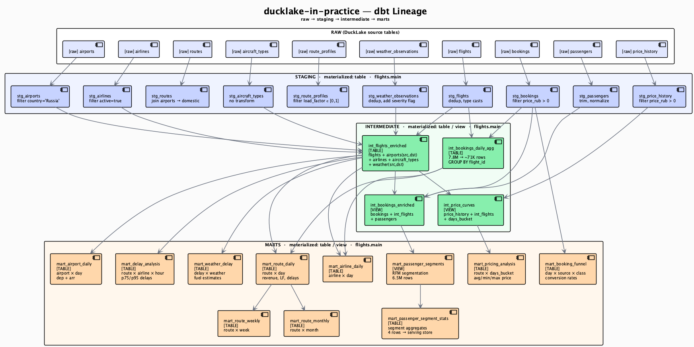
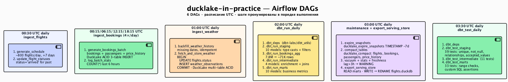

# Слои dbt в ducklake-in-practice

## Граф зависимостей



> PlantUML-источник: [`docs/diagrams/03_dbt_lineage.puml`](../diagrams/03_dbt_lineage.puml)

## Расписание и задачи DAG



> PlantUML-источник: [`docs/diagrams/04_airflow_dags.puml`](../diagrams/04_airflow_dags.puml)

## Обзор

dbt использует адаптер `dbt-duckdb` с флагом `is_ducklake: true`. Все модели материализуются в DuckLake (Parquet + PG-каталог). DuckDB выступает вычислительным движком.

```
raw → staging → intermediate → marts
```

Все модели — `materialized: table`. Полный пересчёт раз в сутки — оптимальная стратегия для sandbox-объёма данных.

## Критические фиксы для dbt + DuckLake

### 1. DATA_PATH через кастомный плагин

Стандартный синтаксис `profiles.yml` для ATTACH с DATA_PATH не работает с DuckLake. Используется кастомный плагин:

```python
# dbt/ducklake_flights/ducklake_attach_plugin.py
conn.execute("""
    ATTACH 'ducklake:postgres:host=postgres port=5432 dbname=ducklake_catalog user=ducklake password=...'
    AS flights (DATA_PATH 's3://ducklake-flights/data/')
""")
conn.execute("SET memory_limit = '6GB'")
conn.execute("SET temp_directory = '/tmp/duckdb_tmp'")
```

```yaml
# profiles.yml
ducklake-in-practice:
  target: dev
  outputs:
    dev:
      type: duckdb
      path: ":memory:"
      plugins:
        - module: ducklake_attach_plugin
      extensions: [ducklake, postgres, httpfs]
      settings:
        s3_endpoint: "rustfs:9000"
        s3_access_key_id: "${RUSTFS_ACCESS_KEY}"
        s3_secret_access_key: "${RUSTFS_SECRET_KEY}"
        s3_use_ssl: false
        s3_url_style: "path"
        memory_limit: "6GB"
        temp_directory: "/tmp/duckdb_tmp"
      threads: 1
```

### 2. threads: 1 — обязательно

DuckLake не поддерживает конкурентную запись. `threads > 1` вызывает конфликты транзакций.

### 3. Макрос drop_relation (CASCADE не поддерживается)

```sql
-- macros/drop_relation.sql

  
    DROP {{ relation.type }} IF EXISTS {{ relation }}
  

```

### 4. staging: materialized = table

Views не переживают смену соединения между шагами pipeline. Staging должен быть физическими таблицами.

### 5. Раздельный запуск слоёв

Запуск всех 25 моделей в одной команде `dbt run` приводит к OOM при 7.8M строк бронирований.
Airflow DAG запускает слои последовательно отдельными командами (см. расписание ниже).

## Конфигурация dbt

### Структура проекта

```
dbt/ducklake_flights/
  dbt_project.yml
  profiles.yml
  ducklake_attach_plugin.py
  macros/
    drop_relation.sql
  models/
    raw/
      schema.yml              ← sources: airports, airlines, routes, flights,
                                 bookings, passengers, price_history,
                                 aircraft_types, weather_observations,
                                 route_profiles
    staging/                  ← 10 моделей, materialized: table
    intermediate/             ← 4 модели, materialized: table (2 — view)
    marts/                    ← 10 моделей, materialized: table (2 — view)
  tests/
    assert_no_future_departures.sql
    assert_revenue_positive.sql
    assert_load_factor_plausible.sql
```

## Слой staging

**Materialization:** `table` в `flights.main`

**Задачи:** очистка, приведение типов, фильтрация мусора.

| Модель | Что делает |
|--------|-----------|
| `stg_airports` | Фильтр country='Russia', trim пробелов, cast типов |
| `stg_airlines` | Фильтр active=true, country='Russia' |
| `stg_routes` | Джойн с airports для валидации, фильтр domestic |
| `stg_flights` | Cast timestamp, фильтр валидных записей |
| `stg_bookings` | Cast типов, фильтр price_rub > 0 |
| `stg_passengers` | Cast типов, нормализация имён |
| `stg_price_history` | Cast типов, фильтр price_rub > 0 |
| `stg_aircraft_types` | Seed флота ВС без трансформаций |
| `stg_weather_observations` | Фильтр валидных записей, добавляет `weather_severity` и `adverse_conditions` |
| `stg_route_profiles` | Seed профилей маршрутов: base_load_factor, price_tier, seasonality |

> UUID-ключи из генератора гарантируют уникальность — ROW_NUMBER() для дедупликации не нужен.

Пример — `stg_bookings.sql`:

```sql
select
    booking_id, flight_id, passenger_id,
    booking_date::timestamp as booking_date, fare_class,
    cast(price_rub as decimal(10,2)) as price_rub, status,
    seat_number, booking_source,
    created_at::timestamp as created_at, updated_at::timestamp as updated_at
from {{ source('raw', 'bookings') }}
where price_rub > 0
```

## Слой intermediate

**Задачи:** обогащение, денормализация, подготовка к агрегации.

| Модель | Materialization | Что делает |
|--------|----------------|-----------|
| `int_flights_enriched` | `table` | flights + airports + airlines + aircraft_types + weather (18 полей) |
| `int_bookings_enriched` | `view` | bookings + flights + passengers + routes (7.8M строк — view для экономии памяти) |
| `int_bookings_daily_agg` | `table` | Предагрегация бронирований per flight_id → ~71K строк (7.8M → 71K) |
| `int_price_curves` | `view` | price_history с расчётом days_before_departure buckets |

### Ключевая оптимизация: int_bookings_daily_agg

Агрегирует 7.8M бронирований до уровня рейса перед джойном с flight_stats в mart-моделях. Без этого mart_route_daily пытался джойнить 7.8M строк — OOM.

```sql
-- int_bookings_daily_agg.sql
select
    b.flight_id, f.flight_date, f.route_key, f.airline_iata,
    count(b.booking_id)               as total_bookings,
    sum(b.price_rub)                  as total_revenue,
    avg(b.price_rub)                  as avg_ticket_price,
    count(distinct b.passenger_id)    as unique_passengers,
    count(case when b.fare_class='economy' then 1 end)  as economy_bookings,
    ...
from {{ ref('stg_bookings') }} b
inner join {{ ref('stg_flights') }} f on b.flight_id = f.flight_id
where b.status not in ('cancelled', 'no_show')
group by 1, 2, 3, 4
```

## Слой marts

**Задачи:** бизнес-метрики, готовые для serving.

### Таблица моделей

| Модель | Materialization | Гранулярность | Метрики |
|--------|----------------|--------------|---------|
| `mart_route_daily` | `table` | route × day | revenue, pax, load_factor, avg_delay, cancellation_rate |
| `mart_route_weekly` | `table` | route × week | Агрегаты за неделю |
| `mart_route_monthly` | `table` | route × month | Агрегаты за месяц |
| `mart_airline_daily` | `table` | airline × day | revenue, flights, cancellation_rate, avg_delay |
| `mart_airport_daily` | `table` | airport × day | departures, arrivals, avg_delay, on_time_rate |
| `mart_booking_funnel` | `table` | day × source × class | confirmed → checked_in → boarded конверсия |
| `mart_pricing_analysis` | `table` | route × days_bucket | Средние цены по bucket дней до вылета |
| `mart_delay_analysis` | `table` | airline × airport × month | Статистика задержек |
| `mart_passenger_segments` | `view` | passenger | RFM-сегментация (6.5M строк — view) |
| `mart_passenger_segment_stats` | `table` | segment | Агрегат по сегментам (4 строки) — для BI-дашборда |
| `mart_weather_delay` | `table` | route × airline × weather | Задержки в разрезе погодных условий |

> `mart_passenger_segments` — `view` из-за 6.5M строк. Исключён из serving store.
> `mart_passenger_segment_stats` — агрегат поверх него: 4 строки (один сегмент на строку). Включён в serving store.

### Пример mart_route_daily

```sql
with flight_stats as (
    select
        src_airport_iata || '-' || dst_airport_iata as route_key,
        src_city || ' → ' || dst_city               as route_name,
        src_airport_iata, dst_airport_iata, flight_date,
        count(*)                                     as total_flights,
        sum(case when status = 'cancelled' then 1 else 0 end) as cancelled_flights,
        avg(delay_minutes) filter (where delay_minutes is not null) as avg_delay_min,
        sum(total_seats)                             as total_capacity
    from {{ ref('int_flights_enriched') }}
    group by 1, 2, 3, 4, 5   -- airline_iata НЕ в GROUP BY: иначе LF > 100%
),
booking_stats as (
    select route_key, flight_date, sum(total_bookings), sum(total_revenue), ...
    from {{ ref('int_bookings_daily_agg') }}
    group by 1, 2
)
select
    f.route_key, f.route_name, f.flight_date,
    ...,
    case when f.total_capacity > 0
         then round(coalesce(b.total_bookings, 0)::float / f.total_capacity * 100, 1)
         else 0 end as load_factor_pct
from flight_stats f
left join booking_stats b on f.route_key = b.route_key and f.flight_date = b.flight_date
```

> **Важно:** `airline_iata` убран из `flight_stats` GROUP BY. Если оставить — каждый маршрут/день разбивается на строки по перевозчику, но `booking_stats` агрегирован на уровне route_key+date. При джойне каждая строка flight_stats получает полный объём бронирований → LF > 100%.

## Тесты dbt (83/83 PASS)

### Schema tests (schema.yml)

| Слой | Тестов | Примеры |
|------|--------|---------|
| staging | 39 | unique/not_null на PK, relationships, accepted_values |
| intermediate | 11 | unique/not_null на PK |
| marts | 33 | accepted_range для LF, revenue, процентных метрик |

### Data tests (SQL)

```sql
-- tests/assert_no_future_departures.sql
select * from {{ ref('stg_flights') }}
where actual_departure > current_timestamp + interval '1 hour'

-- tests/assert_revenue_positive.sql
select * from {{ ref('mart_route_daily') }}
where total_revenue < 0

-- tests/assert_load_factor_plausible.sql
-- до 10% overbooking — норма для авиации
select * from {{ ref('mart_route_daily') }}
where load_factor_pct > 110
```

## Расписание запуска (через Airflow)

| DAG | Расписание | Шаги |
|-----|-----------|------|
| `dbt_run_daily` | Ежедневно 02:00 UTC | **deps** → staging → int_bookings_daily_agg → intermediate → marts |
| `dbt_test_daily` | Ежедневно 03:30 UTC | **deps** → test staging → test intermediate → test marts |
| `dbt_docs_weekly` | По воскресеньям 04:00 UTC | dbt docs generate |

Слои запускаются **отдельными командами** последовательно — не одним `dbt run --select all`. Это предотвращает OOM при обработке 7.8M строк бронирований.

`dbt deps` запускается первым шагом в каждом DAG, чтобы гарантировать наличие пакетов (dbt_utils) после перезапуска контейнеров.
