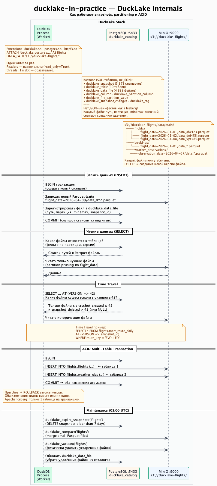

# DuckLake: возможности и ограничения



> PlantUML-источник: [`docs/diagrams/07_ducklake_internals.puml`](../diagrams/07_ducklake_internals.puml)

## Что такое DuckDB и DuckLake

**DuckDB** — аналитический SQL-движок. Работает in-process (внутри Python, Java, любого приложения). Аналог SQLite, но для аналитики. Один процесс, одна машина, никакого отдельного сервера.

**DuckLake** — формат хранения данных (table format), аналог Apache Iceberg или Delta Lake. Не выполняет запросы. Хранит данные как Parquet-файлы в объектном хранилище (MinIO/S3), а метаданные — в SQL-базе (PostgreSQL). Несмотря на "Duck" в названии, DuckLake не привязан к DuckDB.

**Аналогия:** DuckDB = двигатель самолёта. DuckLake = аэродром с ангаром и диспетчерской.

## Демонстрируемые возможности

### 1. Time travel

**Сценарий:** аналитик хочет сравнить среднюю цену на маршрут SVO→LED за последнюю неделю.

```sql
-- Список снэпшотов
SELECT * FROM ducklake_snapshots('flights');

-- Данные на момент снэпшота #42
SELECT * FROM flights.price_history
AT SNAPSHOT 42
WHERE flight_id IN (
    SELECT flight_id FROM flights.flights AT SNAPSHOT 42
    WHERE src_airport_iata = 'SVO' AND dst_airport_iata = 'LED'
);

-- Изменения между снэпшотами
SELECT * FROM ducklake_table_changes('flights', 'bookings', 40, 50);
```

**Что демонстрирует:** DuckLake хранит все версии данных без копирования Parquet-файлов. Старые снэпшоты ссылаются на те же файлы. Time travel не стоит лишнего дискового места.

### 2. ACID multi-table transactions

**Сценарий:** DAG бронирований атомарно пишет в bookings + passengers + price_history.

```sql
BEGIN;
INSERT INTO flights.bookings VALUES (...);
INSERT INTO flights.passengers VALUES (...);
INSERT INTO flights.price_history VALUES (...);
COMMIT;
```

**Что демонстрирует:** при конкурентной записи из двух Airflow-воркеров DuckLake разруливает конфликты через оптимистичный concurrency control. Если оба воркера аппендят данные — оба коммита проходят. Если пишут в одну строку — один откатывается и ретраится.

**Важно:** DuckLake обеспечивает atomicity и isolation, но не решает полностью проблему concurrent writers. При высокой конкуренции нужен retry с exponential backoff.

### 3. Schema evolution

**Сценарий:** через месяц добавляем колонку `baggage_weight` в bookings.

```sql
ALTER TABLE flights.bookings ADD COLUMN baggage_weight DECIMAL(5,1);
```

**Что демонстрирует:** старые Parquet-файлы не перезаписываются. DuckLake добавляет колонку в каталог, новые файлы содержат её, старые — нет (читаются как NULL). Старые снэпшоты через time travel возвращают данные без этой колонки — как будто её никогда не было.

### 4. Partitioning by flight_date

**Сценарий:** ежедневный dbt run обрабатывает данные по маршрутам за конкретные даты.

```sql
CREATE TABLE flights.flights (
    flight_id VARCHAR,
    ...
    flight_date DATE
) PARTITION BY (flight_date);
```

**Что демонстрирует:** DuckLake складывает Parquet-файлы по партициям. Запрос с фильтром по `flight_date` читает только нужные файлы (partition pruning). dbt-модели при пересчёте конкретного маршрута за период не трогают данные других дат.

### 5. Data inlining

**Сценарий:** батчи бронирований 4 раза в сутки могут быть малы для отдельного Parquet-файла.

```sql
-- DATA_INLINING_ROW_LIMIT включён по умолчанию
-- Мелкие батчи хранятся в PG-каталоге, не создавая маленьких файлов
ATTACH 'ducklake:...' AS flights (
    DATA_INLINING_ROW_LIMIT 500
);
```

**Что демонстрирует:** мелкие батчи не создают "small file problem". Данные инлайнятся в PostgreSQL-каталог. При накоплении достаточного объёма или по расписанию — компактируются в Parquet.

### 6. File compaction

**Сценарий:** после суток ежечасных батчей накопилось 24 мелких файла в одной партиции.

```sql
-- Слить мелкие файлы
CALL ducklake_merge_adjacent_files('flights');
```

**Что демонстрирует:** операция полностью онлайн, не блокирует читателей. Старые файлы помечаются для удаления, но не удаляются до вызова cleanup. Компакция улучшает performance последующих read-запросов.

### 7. Snapshot expiry + cleanup (TTL raw = 7 дней)

**Сценарий:** raw-слой хранится 7 дней, старые данные удаляются.

```sql
-- Удалить снэпшоты старше 7 дней
CALL ducklake_expire_snapshots('flights', older_than => now() - INTERVAL 7 DAY);

-- Удалить файлы без активных снэпшотов
CALL ducklake_cleanup_old_files('flights');
```

**Что демонстрирует:** управление жизненным циклом. TTL raw-слоя — 7 дней, mart-слой хранится бессрочно. Cleanup физически удаляет Parquet-файлы из MinIO.

### 8. DuckDB in-process для API serving

**Сценарий:** FastAPI отдаёт агрегаты через DuckDB без отдельного query-сервера.

```python
import duckdb

conn = duckdb.connect(read_only=True)
conn.execute("INSTALL ducklake; LOAD ducklake; ...")
conn.execute("ATTACH 'ducklake:postgres:...' AS flights (DATA_PATH 's3://...')")

result = conn.execute("""
    SELECT * FROM flights.mart_route_daily
    WHERE route_key = 'SVO-LED'
    ORDER BY flight_date DESC
    LIMIT 30
""").fetchdf()
```

**Что демонстрирует:** DuckDB как embedded query engine для API. Читает готовые агрегаты из mart-слоя. Никакого ETL в отдельную serving-базу.

## Известные ограничения (на момент v0.4)

| Ограничение | Влияние | Workaround |
|-------------|---------|-----------|
| Экспериментальный статус | Не для production с SLA | Sandbox-проект, допустимо |
| Single-writer per process | Конкуренция двух воркеров | Retry с exponential backoff |
| Нет CASCADE DROP | dbt падает без патча | Макрос drop_relation.sql |
| Нет constraints/indexes | Нельзя PK/FK на уровне DuckLake | Валидация через dbt tests |
| threads: 1 обязателен | dbt работает медленнее | Принятый trade-off |
| DATA_PATH не через options | profiles.yml сложнее | Кастомный плагин |
| BI-инструменты через DuckLake | Высокий I/O latency для serving-запросов | Serving store паттерн (export-serving-store.py) |
| Join performance на Parquet | Сложные join-ы медленнее | Денормализация в mart-слое |
| Нет built-in encryption | Данные в Parquet не зашифрованы | Network-level security |

## Production gotchas первого запуска

Это не баги документации — это реальные проблемы, обнаруженные при первом запуске проекта.

### executemany() не работает с DuckLake

DuckLake не поддерживает `executemany()`. При попытке пакетной вставки через `executemany` возникает ошибка или данные не вставляются.

**Правильный подход:** temp table + INSERT SELECT.

```python
# Неправильно:
conn.executemany("INSERT INTO flights.bookings VALUES (?, ?, ...)", rows)

# Правильно:
conn.execute("CREATE TEMP TABLE tmp_bookings AS SELECT * FROM bookings WHERE 1=0")
conn.executemany("INSERT INTO tmp_bookings VALUES (?, ?, ...)", rows)
conn.execute("INSERT INTO flights.bookings SELECT * FROM tmp_bookings")
```

### `changes()` — функция SQLite, в DuckDB не существует

После UPDATE DuckDB не предоставляет `changes()` (это SQLite API). Используйте явный `SELECT COUNT(*)`.

```python
# Неправильно:
conn.execute("SELECT changes()").fetchone()[0]

# Правильно:
conn.execute(
    "SELECT COUNT(*) FROM flights.flights WHERE ... AND updated_at >= ?", [now]
).fetchone()[0]
```

### TIMESTAMP из DuckLake — naive datetime (без timezone)

DuckDB возвращает TIMESTAMP-колонки как Python `datetime` без tzinfo. При сравнении с `datetime.now(timezone.utc)` через pendulum возникает `TypeError: can't compare offset-naive and offset-aware datetimes`. Нормализуйте перед арифметикой:

```python
if departure.tzinfo is None:
    departure = departure.replace(tzinfo=timezone.utc)
```

### MinIO hostname в путях файлов фиксируется при создании таблицы

DuckLake записывает абсолютные пути к Parquet-файлам в PostgreSQL-каталог в момент создания таблицы. Если таблица создана с `minio:9000`, то все файлы будут доступны только через этот хост. Смена hostname = полное пересоздание таблиц.

### Serving store — правильный паттерн для BI

DuckLake не является serving-слоем по дизайну. Читать Parquet-файлы из S3 через DuckLake-расширение при каждом запросе Superset — это слишком высокий I/O latency. Правильный подход: `docker/export-serving-store.py` атомарно экспортирует mart-таблицы из DuckLake в `/serving/flights.duckdb`. Superset подключается к этому стандартному DuckDB-файлу через `duckdb-engine` без каких-либо расширений. Файл обновляется Airflow DAG `dag_export_serving_store` ежедневно в 03:00 UTC после `dbt_run_daily`.

Это тот же паттерн, что используется в промышленных lakehouse: Iceberg→Redshift, Delta→Synapse.

## Сравнение с альтернативами

| Аспект | DuckLake | Iceberg | Delta Lake |
|--------|----------|---------|------------|
| Каталог метаданных | SQL-база (PG/MySQL/SQLite) | JSON/Avro файлы + каталог (REST/Hive) | JSON transaction log |
| Сложность операций | Низкая (SQL-команды) | Высокая (manifest, snapshot, metadata files) | Средняя |
| Конкурентная запись | Через PG-блокировки | Через каталог | Через log |
| Time travel | Встроен | Встроен | Встроен |
| Экосистема | DuckDB (пока) | Spark, Trino, Flink, DuckDB | Spark, Databricks |
| Зрелость | Experimental (v0.4) | Production | Production |
| Сложность setup | Очень низкая | Высокая | Средняя |
